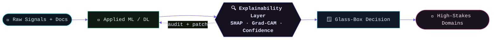

<!--
  ░░ surajmeruva0786 ░░ "The Glass Box" profile
  Bespoke animated SVGs live in /assets and render after the first push to main.
  Light/dark adaptive via <picture>. Stat cards use community mirrors (canonical URLs kept in comments).
-->

<div align="center">

<!-- ══════════════ ANIMATED HEADER (hand-coded · light + dark) ══════════════ -->
<picture>
  <source media="(prefers-color-scheme: dark)"  srcset="https://raw.githubusercontent.com/surajmeruva0786/surajmeruva0786/main/assets/header-dark.svg">
  <source media="(prefers-color-scheme: light)" srcset="https://raw.githubusercontent.com/surajmeruva0786/surajmeruva0786/main/assets/header-light.svg">
  
</picture>

<!-- ══════════════ STATUS TICKER ══════════════ -->
<a href="https://github.com/surajmeruva0786">
  
</a>

<!-- ══════════════ CONTROL PANEL (links + honest stats) ══════════════ -->
<p>
  <a href="https://github.com/surajmeruva0786"></a>
  <a href="https://www.linkedin.com/in/suraj-meruva/"></a>
  <a href="https://www.kaggle.com/meruvakodandasuraj"></a>
  <a href="https://x.com/SurajMeruva786"></a>
  <a href="mailto:meruva24102@iiitnr.edu.in"></a>
</p>

<p>
  
  
  
  
</p>

</div>

---

## `// 00 · MANIFEST`

```yaml
# ~/.config/suraj.yaml
identity:
  name:   Suraj Meruva
  alias:  meruvakodandasuraj                       # kaggle
  role:   AI/ML Engineer · Researcher · Full-Stack Developer
  base:   IIIT Naya Raipur — B.Tech, Data Science & AI (2024 → 2028)

thesis: >
  I don't ship black boxes. Every model I build explains itself —
  SHAP, Grad-CAM, confidence maps — because high-stakes domains
  can't trust what they can't audit.

building:
  applied_ml:  [ biomedical-signals(ECG·PPG·EEG), predictive-maintenance(RUL), sonar/vibration ]
  llm_agents:  [ multi-agent-systems, PEFT/LoRA, RAG, document-intelligence(OCR) ]
  full_stack:  [ react, next.js, fastapi, "kafka · timescaledb · redis" ]

domains:  [ defence(DRDO), energy(NTPC), naval(NSTL), law-enforcement, govtech, fintech, healthtech ]
now:      "patent-pending OCR confidence engine (FileTract) + multi-agent quant finance (UMQ-Agent)"
open_to:  "AI/ML research & SWE internships · open-source · collaborations"
```

---

## `// 01 · THE METHOD`

Most ML ships a number and asks you to trust it. I build the opposite: pipelines where **every prediction arrives with its receipts** — *which* feature, *which* frequency band, *which* pixel drove the call. That feedback loop doesn't just explain the model, it **audits and patches** it.



---

## `// 02 · FIELD NOTES`

*Selected builds — most ship with explainability wired in.*

#### 🪟 &nbsp;FileTract · *self-auditing OCR engine*
> Turns degraded scans into structured data, then **scores its own certainty** field-by-field — and re-reads only the regions it doubts.
>
> `Python` · `OCR` · `Computer Vision` · `Patent-pending`
> &nbsp;🔍 **Explains →** per-field confidence maps · adaptive re-OCR · confidence-weighted fusion

#### 🧠 &nbsp;AeroMind · *EEG cognitive-fatigue radar*
> Reads an operator's brainwaves in real time to flag fatigue **before** it gets dangerous — built for pilots, drone operators & submariners *(DRDO / DIPAS domain)*.
>
> `PyTorch` · `MNE-Python` · `CapsuleNet + LSTM` · `XAI`
> &nbsp;🔍 **Explains →** SHAP attributions painted onto a 2D scalp topography

#### 📈 &nbsp;UMQ-Agent · *multi-agent quant-finance platform*
> Autonomous agents stream live markets and surface **risk & fraud** in real time, on a clean microservice backbone.
>
> `Python` · `Multi-Agent` · `Kafka` · `TimescaleDB` · `Redis` · `React`
> &nbsp;🔍 **Explains →** traceable agent decisions + live monitoring dashboard

#### 🪪 &nbsp;CSC Sahayak · *AI co-pilot for India's service centres* &nbsp;`⭐ most-forked`
> A Chrome extension + desktop app that auto-fills government portals and cuts citizen application rejections — **bilingually**.
>
> `TypeScript` · `Python` · `LLM` · `Document-AI`
> &nbsp;🔍 **Explains →** extraction backed by FileTract's confidence scoring

<details>
<summary><b>&nbsp;▸ &nbsp;more builds in the hangar</b></summary>

<br/>

| Project | Domain | What it does |
|---|---|---|
| **TurboGuard** | ⚡ Energy *(NTPC)* | Vibration-based predictive maintenance + Remaining-Useful-Life, SHAP-explained |
| **HydroSense** | 🌊 Naval *(NSTL)* | Explainable passive-sonar vessel classification (Grad-CAM + SHAP) |
| **CG Police** | 👮 Law Enforcement | Deepfake detection + malicious-URL + cyber-intel platform |
| **XAI-DBMS** | 🗄️ Data | LLM-powered ML workbench with transparent, auditable predictions |
| **PEFT Research** | 🧪 LLM | Cross-domain transfer (medical ↔ legal) at 95%+ fewer trained params |
| **ECG/PPG** | 🫀 HealthTech | Heart-attack prediction from physiological signals |
| **Jungle Safari** | 🐯 Orbis Systems | Official website + mobile app for Jungle Safari, Naya Raipur |
| **nanoGPT** | 🧠 Foundations | A GPT built from scratch, the Karpathy way |

</details>

---

## `// 03 · MISSION DOMAINS`

<div align="center">

| Domain | Build | Real-world stake |
|:--|:--|:--|
| 🛡️ **Defence — Aircrew** | `AeroMind` | Catch cognitive fatigue before a fatal mistake |
| ⚡ **Energy — Power Plants** | `TurboGuard` | Predict machine failure before it happens |
| 🌊 **Naval — Acoustics** | `HydroSense` | Identify vessels from underwater sound |
| 👮 **Law Enforcement** | `CG Police` | Fight deepfakes & cybercrime at scale |
| 🏛️ **GovTech — Citizens** | `CSC Sahayak` | Fewer rejected applications, faster service |
| 💸 **FinTech — Markets** | `UMQ-Agent` | Real-time risk & fraud intelligence |
| 🫀 **HealthTech — Signals** | `ECG/PPG` | Earlier warning from heart signals |

</div>

---

## `// 04 · INSTRUMENTS`

<div align="center">

<picture>
  <source media="(prefers-color-scheme: dark)"  srcset="https://skillicons.dev/icons?i=python,pytorch,tensorflow,sklearn,opencv,fastapi,react,nextjs,ts,nodejs,tailwind,docker,kafka,redis,postgres,mongodb,git,vscode,figma,vercel&theme=dark&perline=10">
  <source media="(prefers-color-scheme: light)" srcset="https://skillicons.dev/icons?i=python,pytorch,tensorflow,sklearn,opencv,fastapi,react,nextjs,ts,nodejs,tailwind,docker,kafka,redis,postgres,mongodb,git,vscode,figma,vercel&theme=light&perline=10">
  
</picture>

<sub>**+ explainability:** SHAP · Grad-CAM · LIME &nbsp;|&nbsp; **+ LLM/agents:** Hugging Face · LangChain · PEFT/LoRA &nbsp;|&nbsp; **+ data:** Pandas · NumPy · SciPy</sub>

</div>

---

## `// 05 · TELEMETRY`

<div align="center">

<!-- canonical (use when up): https://github-readme-stats.vercel.app/api?username=surajmeruva0786 -->


<br/>

<!-- canonical (use when up): https://github-readme-stats.vercel.app/api/top-langs/?username=surajmeruva0786 -->


</div>

---

## `// 06 · TRAJECTORY`

<div align="center">

<picture>
  <source media="(prefers-color-scheme: dark)"  srcset="https://raw.githubusercontent.com/surajmeruva0786/surajmeruva0786/output/github-contribution-grid-snake-dark.svg">
  <source media="(prefers-color-scheme: light)" srcset="https://raw.githubusercontent.com/surajmeruva0786/surajmeruva0786/output/github-contribution-grid-snake.svg">
  
</picture>


</div>

---

## `// 07 · UPLINK`

<div align="center">

I publish datasets, research notebooks & ML-competition work on **Kaggle**, and I'm always up for a good problem in explainable / applied AI.


<p>
  <a href="https://www.linkedin.com/in/suraj-meruva/"></a>
  <a href="https://www.kaggle.com/meruvakodandasuraj"></a>
  <a href="mailto:meruva24102@iiitnr.edu.in"></a>
</p>

</div>

<!-- ══════════════ ANIMATED FOOTER (hand-coded · light + dark) ══════════════ -->
<div align="center">
<picture>
  <source media="(prefers-color-scheme: dark)"  srcset="https://raw.githubusercontent.com/surajmeruva0786/surajmeruva0786/main/assets/footer-dark.svg">
  <source media="(prefers-color-scheme: light)" srcset="https://raw.githubusercontent.com/surajmeruva0786/surajmeruva0786/main/assets/footer-light.svg">
  
</picture>
</div>
